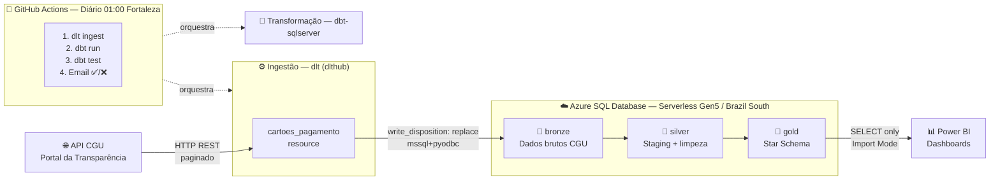

# 🏛️ Pipeline de Engenharia de Dados — Portal da Transparência (CGU)

> Pipeline end-to-end que extrai dados de gastos com Cartão de Pagamento do Governo Federal (CPGF) da API pública da CGU, transforma via arquitetura Medalhão e entrega um Star Schema no Azure SQL pronto para análise no Power BI.

<div align="center">

[](https://github.com/alanoregis/Projeto-portal-transparencia-pipeline/actions/workflows/pipeline_transparencia.yml)


</div>

---

## 📋 Índice

1. [Arquitetura](#1-arquitetura)
2. [Stack Tecnológica](#2-stack-tecnológica)
3. [Como Rodar o Projeto](#3-como-rodar-o-projeto)
4. [Estrutura de Pastas](#4-estrutura-de-pastas)
5. [Modelagem de Dados](#5-modelagem-de-dados)
6. [Decisões Técnicas e Desafios](#6-decisões-técnicas-e-desafios)
7. [Resultados e Qualidade de Dados](#7-resultados-e-qualidade-de-dados)
8. [Próximos Passos](#8-próximos-passos)

---

## 1. Arquitetura

Pipeline end-to-end com execução diária automatizada via GitHub Actions:



**Fluxo resumido:**

| Etapa | Ferramenta | Schema | O que acontece |
|-------|-----------|--------|----------------|
| Extração | `dlt` + `CGUClient` | — | Paginação da API REST com rate limit control |
| Bronze | `dlt` → Azure SQL | `bronze` | Dados brutos carregados com `replace` |
| Silver | `dbt` | `silver` | Limpeza, tipagem T-SQL, deduplicação via CTE |
| Gold | `dbt` | `gold` | Star Schema pronto + Z-score de anomalia |
| CI/CD | GitHub Actions | — | Agendamento diário + notificação por email |
| Consumo | Power BI Desktop | `gold.*` | 6 tabelas conectadas via ODBC |

---

## 2. Stack Tecnológica

| Camada | Tecnologia | Versão | Função |
|--------|-----------|--------|--------|
| **Ingestão** | [dlt (dlthub)](https://dlthub.com/) | `>=1.3.0` | Extração paginada da API CGU |
| **Transformação** | [dbt-sqlserver](https://docs.getdbt.com/docs/core/connect-data-platform/mssql-setup) | `1.11.1` | Modelagem Medalhão Silver/Gold |
| **Banco de dados** | Azure SQL Database Serverless | Gen5 / 2 vCores | Destino cloud com auto-pause |
| **Orquestração** | GitHub Actions | — | CI/CD diário com cron |
| **Visualização** | Power BI Desktop | — | Dashboards com Star Schema |
| **Linguagem** | Python | 3.11 | Scripts de orquestração e ingestão |
| **Conector** | pyodbc + SQLAlchemy | `>=5.0 / >=2.0` | Conexão Python → Azure SQL |
| **Notificação** | Gmail SMTP | — | Email de sucesso/falha automático |

---

## 3. Como Rodar o Projeto

### Pré-requisitos

- Python 3.11+
- [Microsoft ODBC Driver 17 for SQL Server](https://learn.microsoft.com/pt-br/sql/connect/odbc/download-odbc-driver-for-sql-server)
- Conta na Azure (banco já provisionado) **ou** use o modo `sample` (sem Azure)
- Chave de API da CGU ([obter aqui](https://api.portaldatransparencia.gov.br/swagger-ui.html))

### 1. Clonar o repositório

```bash
git clone https://github.com/alanoregis/Projeto-portal-transparencia-pipeline.git
cd Projeto-portal-transparencia-pipeline
```

### 2. Criar e ativar o ambiente virtual

```bash
# Windows
python -m venv .venv
.venv\Scripts\activate

# Linux / macOS
python3 -m venv .venv
source .venv/bin/activate
```

### 3. Instalar dependências

```bash
pip install -r requirements.txt
cd dbt_transparencia && dbt deps --profiles-dir . && cd ..
```

### 4. Configurar variáveis de ambiente

Crie um arquivo `.env` na raiz do projeto:

```dotenv
# Credenciais Azure SQL
AZURE_SQL_SERVER=seu-servidor.database.windows.net
AZURE_SQL_DATABASE=nome-do-banco
AZURE_SQL_USER=seu-usuario
AZURE_SQL_PASSWORD=sua-senha
AZURE_SQL_DRIVER=ODBC Driver 17 for SQL Server

# API do Portal da Transparência (CGU)
CGU_API_KEY=sua-chave-aqui

# Modo de ingestão: "api" (dados reais) ou "sample" (testes locais sem Azure)
INGESTION_MODE=sample

# Período de extração (apenas no modo "api")
EXTRACT_MES_EXTRATO_INICIO=01/2024
EXTRACT_MES_EXTRATO_FIM=12/2024
MAX_PAGES_PER_MONTH=50
```

> ⚠️ O arquivo `.env` está no `.gitignore`. Nunca faça commit de credenciais.

### 5. Executar o pipeline completo

```bash
python run_pipeline.py
```

O orquestrador executa em sequência:
1. **Ingestão dlt** → carrega Bronze no Azure SQL
2. **dbt run** → transforma Silver + Gold
3. **dbt test** → valida 48 testes de qualidade
4. **Resumo Gold** → exibe contagem de registros por tabela

**Ou etapas individuais:**

```bash
# Apenas ingestão (Bronze)
python ingestion/pipeline_transparencia.py

# Apenas transformação
dbt run --project-dir dbt_transparencia --profiles-dir dbt_transparencia

# Apenas testes de qualidade
dbt test --project-dir dbt_transparencia --profiles-dir dbt_transparencia
```

### 6. Conectar no Power BI

1. **Obter Dados → Azure SQL Database**
2. Servidor: `seu-servidor.database.windows.net`
3. Autenticação: **Banco de dados** (usuário/senha)
4. Importar as tabelas do schema `gold`:
   - `gold.fct_gastos_cartao`
   - `gold.dim_data`, `gold.dim_orgaos`, `gold.dim_favorecidos`
   - `gold.dim_portadores`, `gold.dim_nivel_alerta`

---

## 4. Estrutura de Pastas

```
Projeto-portal-transparencia-pipeline/
│
├── .github/
│   └── workflows/
│       └── pipeline_transparencia.yml  # CI/CD — cron diário + email de alerta
│
├── ingestion/
│   ├── pipeline_transparencia.py       # Recurso dlt: extrai API CGU → Bronze
│   ├── cgu_client.py                   # Client HTTP (paginação + rate limit)
│   └── sample_data.py                  # Dados de amostra para dev/test local
│
├── dbt_transparencia/
│   ├── models/
│   │   ├── silver/                     # Camada Silver: staging e limpeza
│   │   │   ├── stg_cpgf_despesas.sql   # Staging principal com tipagem T-SQL
│   │   │   ├── dim_data.sql            # Calendário via tally table (sem recursão)
│   │   │   ├── dim_orgaos.sql          # Deduplicação CTE + ROW_NUMBER
│   │   │   ├── dim_favorecidos.sql     # Dimensão favorecidos deduplicada
│   │   │   ├── dim_portadores.sql      # Dimensão portadores do cartão
│   │   │   ├── fct_gastos_cartao.sql   # Fato Silver com surrogate keys
│   │   │   └── schema.yml              # Testes: not_null, unique, relationships
│   │   └── gold/                       # Camada Gold: Star Schema final
│   │       ├── gold_dim_data.sql       # Alias="dim_data" para nome limpo no Azure
│   │       ├── gold_dim_orgaos.sql
│   │       ├── gold_dim_favorecidos.sql
│   │       ├── gold_dim_portadores.sql
│   │       ├── gold_dim_nivel_alerta.sql  # Dimensão estática de alertas
│   │       ├── gold_fct_gastos_cartao.sql # Fato Gold com Z-score (STDEV T-SQL)
│   │       └── schema.yml
│   ├── dbt_project.yml                 # Schemas por camada + flags T-SQL
│   ├── profiles.yml                    # Conexão via env vars
│   └── packages.yml                    # dbt_utils
│
├── run_pipeline.py                     # Orquestrador: dlt → dbt run → dbt test
├── requirements.txt                    # Dependências Python
└── Dockerfile                          # Imagem para execução containerizada
```

---

## 5. Modelagem de Dados

### Star Schema — Camada Gold

```
                    ┌─────────────────────┐
                    │    dim_data         │
                    │─────────────────────│
                    │ sk_data (PK)        │
                    │ dt_data             │
                    │ ano / mes / dia     │
                    │ nome_mes (pt-BR)    │
                    │ trimestre / semana  │
                    └──────────┬──────────┘
                               │
         ┌─────────────────────┼──────────────────────┐
         │                     │                      │
┌────────┴────────┐  ┌─────────┴────────────┐  ┌─────┴────────────────┐
│   dim_orgaos    │  │  fct_gastos_cartao   │  │  dim_favorecidos     │
│─────────────────│  │──────────────────────│  │──────────────────────│
│ sk_orgao (PK)   │  │ sk_gasto (PK)        │  │ sk_favorecido (PK)   │
│ cod_orgao_sup   │  │ sk_data (FK)         │  │ nome_favorecido      │
│ nome_orgao_sup  │  │ sk_orgao (FK)        │  │ cnpj_cpf_favorecido  │
│ cod_ug          │  │ sk_favorecido (FK)   │  └──────────────────────┘
│ nome_ug         │  │ sk_portador (FK)     │
└─────────────────┘  │ sk_nivel_alerta (FK) │  ┌──────────────────────┐
                     │ valor_transacao      │  │  dim_portadores      │
┌─────────────────┐  │ zscore_valor         │  │──────────────────────│
│dim_nivel_alerta │  │ tipo_transacao       │  │ sk_portador (PK)     │
│─────────────────│  └──────────────────────┘  │ nome_portador        │
│ sk_nivel (PK)   │                             │ cpf_portador         │
│ nivel_alerta    │                             └──────────────────────┘
│ descricao_nivel │
│ faixa_zscore    │
└─────────────────┘
```

### Classificação de Anomalia (Z-score)

```sql
-- Cálculo em gold_fct_gastos_cartao.sql
zscore_valor = (valor_transacao - AVG(valor_transacao) OVER ()) 
             / NULLIF(STDEV(valor_transacao) OVER (), 0)

-- Regras em dim_nivel_alerta:
-- |Z| < 2.0  →  NORMAL
-- |Z| < 3.0  →  MODERADO  
-- |Z| >= 3.0 →  CRÍTICO
```

> 📸 **Recomendação visual:** Adicione um screenshot da **Model View do Power BI** mostrando as tabelas Gold e seus relacionamentos como um Star Schema. Salve em `docs/images/powerbi_model_view.png` e referencie aqui.

---

## 6. Decisões Técnicas e Desafios

### Por que dlt para ingestão, em vez de requests puro?

O `dlt` oferece **schema inference automático**, controle de estado e `write_disposition="replace"` que garante idempotência. Com requests puro, eu precisaria gerenciar schema, transações e deduplicação manualmente.

**Trade-off:** O dlt adiciona abstração que pode ocultar erros de conexão. Mitigado com inspeção da cadeia de exceções em `is_azure_transient_error()`.

---

### Por que Azure SQL Serverless, e não DuckDB ou VM?

| Opção | Vantagem | Desvantagem |
|-------|----------|-------------|
| **Azure SQL Serverless ✅** | Cloud, seguro, acessível pelo Power BI | Latência no auto-resume (erro 40613) |
| DuckDB local | Zero custo, velocidade local | Não acessível remotamente via Power BI |
| Azure VM | Controle total | Custo fixo 24/7, manutenção |

**Decisão:** Serverless com **auto-pause de 1 hora** mantém custo próximo de zero — o pipeline roda 1x/dia e o banco fica pausado ~23h.

**Desafio real:** O Azure SQL retorna erro **40613** enquanto "acorda" do auto-pause. Implementei **retry com backoff exponencial** (10s → 20s → 40s).

---

### A migração DuckDB → Azure SQL: dialeto T-SQL

O projeto nasceu com DuckDB local. A migração exigiu reescrever **todos os modelos dbt** em T-SQL puro:

| DuckDB / Postgres | T-SQL (Azure SQL) |
|-------------------|-------------------|
| `QUALIFY ROW_NUMBER() = 1` | CTE + `WHERE rn = 1` |
| `SPLIT_PART(col, '/', 1)` | `SUBSTRING(col, 1, CHARINDEX('/', col) - 1)` |
| `STRFTIME('%m', date)` | `FORMAT(date, 'MMMM', 'pt-BR')` |
| `TRY_STRPTIME(col, '%d/%m/%Y')` | `TRY_CONVERT(DATE, col, 103)` |
| `STDDEV(col)` | `STDEV(col)` |
| `dbt_utils.date_spine` | Tally table com `CROSS JOIN` |
| `col::DATE` | `CAST(col AS DATE)` |

**Desafio específico:** `dbt_utils.date_spine` gera CTE recursivo que estoura o limite de **100 recursões** do SQL Server. Substituí por **tally table** (cross join de números) que gera datas sem recursão — solução mais performática.

---

### Por que GitHub Actions para CI/CD?

Tentei Azure Container Apps Jobs e Azure Container Registry Tasks com a conta Azure for Students — ambos **bloqueados por política** (`TasksOperationsNotAllowed`, `ExpressEnvironmentResourceNotSupported`).

GitHub Actions foi a solução: gratuito, integrado, e permite instalar o ODBC Driver 17 no runner Ubuntu via `apt-get`.

**Trade-off:** Sem retry nativo por etapa, observabilidade limitada vs. Airflow/Prefect. Compensado com **email de alerta de falha imediato** via Gmail SMTP.

---

### Controle do Rate Limit da API CGU

A API bloqueia a chave por **8 horas** ao exceder o limite. A chave foi bloqueada durante testes com `MAX_PAGES_PER_MONTH=100`.

**Solução:** Produção usa `MAX_PAGES_PER_MONTH=50` + modo `INGESTION_MODE=sample` para desenvolvimento local sem consumir cota da API.

---

## 7. Resultados e Qualidade de Dados

### Testes dbt — 100% de aprovação

```
PASS=48  WARN=0  ERROR=0  SKIP=0  TOTAL=48
```

| Tipo de Teste | O que valida |
|--------------|--------------|
| `not_null` | Surrogate keys e chaves naturais em todas as tabelas |
| `unique` | Surrogate keys nas dimensões e fato |
| `relationships` | Integridade referencial: cada FK da fato existe na dimensão |
| `accepted_values` | `nivel_alerta` ∈ {NORMAL, MODERADO, CRÍTICO} |

### Tabelas Gold entregues

| Tabela | Descrição |
|--------|-----------|
| `gold.fct_gastos_cartao` | Fato principal: gastos com Z-score + nível de alerta |
| `gold.dim_data` | Calendário 2023–2026 com Unknown Member |
| `gold.dim_orgaos` | Órgãos superiores e unidades gestoras |
| `gold.dim_favorecidos` | Beneficiários dos pagamentos |
| `gold.dim_portadores` | Portadores do cartão corporativo |
| `gold.dim_nivel_alerta` | Classificação de anomalia por Z-score |

> 📸 **Recomendação:** Screenshot do terminal com `PASS=48 WARN=0 ERROR=0` em `docs/images/dbt_test_results.png`

> 📸 **Recomendação:** Screenshot do GitHub Actions com execução verde em `docs/images/github_actions_success.png`

---

## 8. Próximos Passos

| Prioridade | Melhoria | Impacto |
|-----------|----------|---------|
| 🔴 Alta | **Ingestão incremental** — substituir `replace` por `append` com watermark por data | Menos requisições à API CGU; histórico preservado |
| 🔴 Alta | **Power BI Service** — publicar dashboard com refresh automático | Acessível via browser sem Power BI Desktop |
| 🟡 Média | **Orquestrador robusto** — Prefect ou Dagster com DAG visual e retry por etapa | Observabilidade e rastreabilidade de falhas |
| 🟡 Média | **Expandir domínio** — outras APIs da CGU: diárias, servidores, licitações | Análises cruzadas mais ricas |
| 🟡 Média | **Anomaly detection com ML** — Isolation Forest substituindo Z-score estático | Maior acurácia, menos falsos positivos |
| 🟢 Baixa | **dbt docs publicados** — GitHub Pages com documentação interativa do modelo | Portfólio e onboarding de novos analistas |
| 🟢 Baixa | **dbt expectations** — testes de distribuição e ranges esperados | Cobertura de qualidade ainda mais robusta |

---

## 👤 Autor

**Alan Regis**
📍 Fortaleza - CE, Brasil
💼 [linkedin.com/in/alanoregis](https://linkedin.com/in/alanoregis)
🐙 [github.com/alanoregis](https://github.com/alanoregis)

---

<div align="center">

*Dados abertos do [Portal da Transparência do Governo Federal](https://portaldatransparencia.gov.br/) — CGU*

</div>