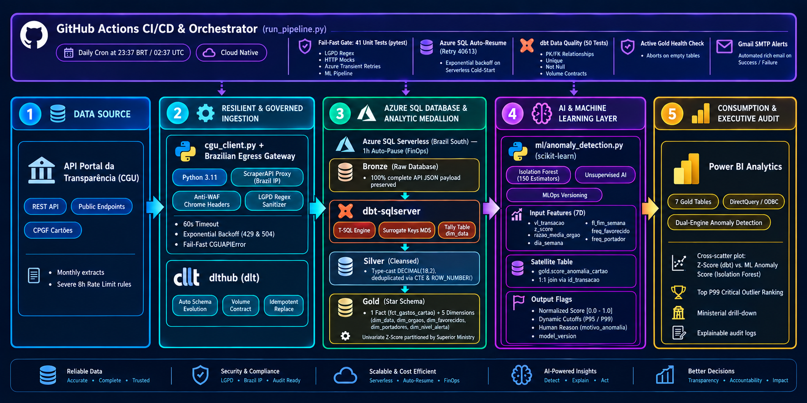
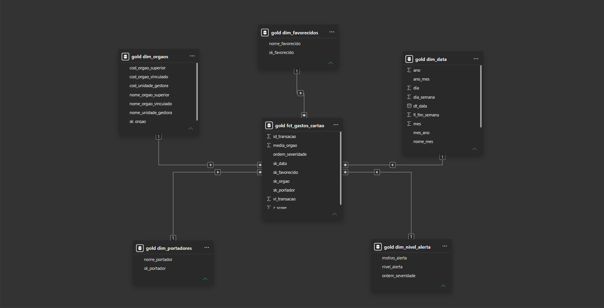
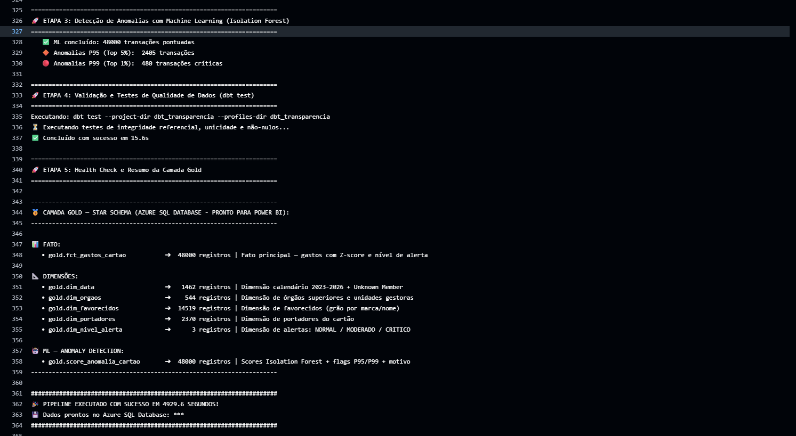
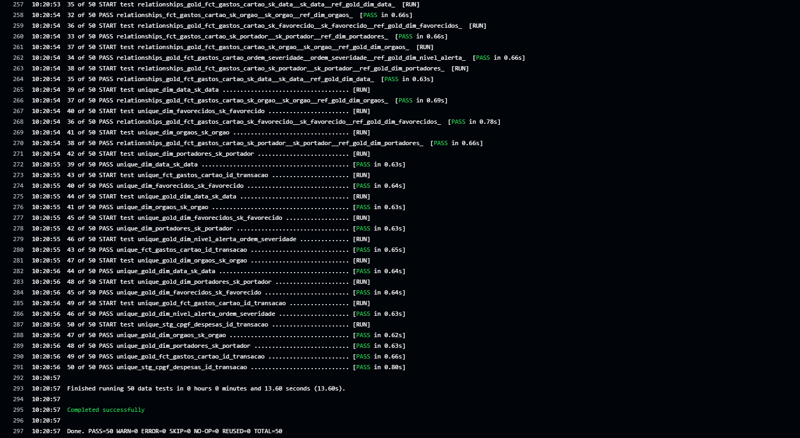
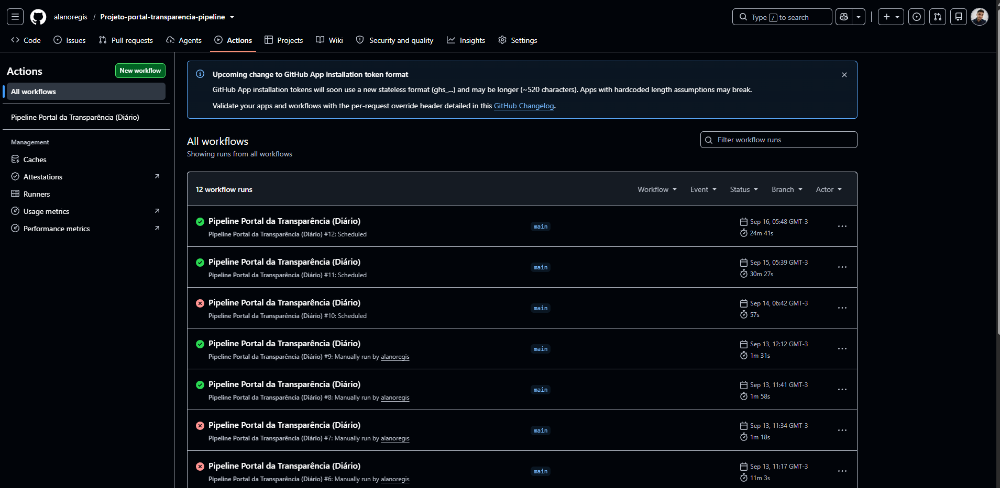

# 🏛️ Pipeline de Engenharia de Dados — Portal da Transparência (CGU)

> Pipeline end-to-end que extrai dados de gastos com Cartão de Pagamento do Governo Federal (CPGF) da API pública da CGU, transforma via arquitetura Medalhão e entrega um Star Schema no Azure SQL pronto para análise no Power BI.

<div align="center">

[](https://github.com/alanoregis/Projeto-portal-transparencia-pipeline/actions/workflows/pipeline_transparencia.yml)


</div>

---

## 📋 Índice

1. [Arquitetura](#1-arquitetura)
2. [Stack Tecnológica](#2-stack-tecnológica)
3. [Como Rodar o Projeto](#3-como-rodar-o-projeto)
4. [Estrutura de Pastas](#4-estrutura-de-pastas)
5. [Modelagem de Dados & Machine Learning](#5-modelagem-de-dados--machine-learning)
6. [Decisões Técnicas e Desafios](#6-decisões-técnicas-e-desafios)
7. [Resultados e Qualidade de Dados](#7-resultados-e-qualidade-de-dados)

---

## 1. Arquitetura

Pipeline end-to-end com execução diária automatizada via GitHub Actions:



**Fluxo resumido:**

| Etapa | Ferramenta | Schema | O que acontece |
|-------|-----------|--------|----------------|
| Extração | `dlt` + `CGUClient` | — | Paginação da API REST com rate limit control e Egress Gateway (Brasil) |
| Bronze | `dlt` → Azure SQL | `bronze` | Dados brutos carregados com `replace` (preservando 100% da fonte) |
| Silver | `dbt` | `silver` | Limpeza, tipagem T-SQL, deduplicação via CTE e higienização LGPD |
| Gold (Star Schema) | `dbt` | `gold` | Star Schema dimensional + Z-Score estatístico univariado |
| Gold (ML Anomalias) | `scikit-learn` | `gold` | Isolation Forest multivariado gravando `gold.score_anomalia_cartao` |
| CI/CD | GitHub Actions | — | Agendamento diário + Fail-Fast pytest + notificação por email |
| Consumo | Power BI Desktop | `gold.*` | 7 tabelas conectadas via ODBC (Fato + 5 Dimensões + 1 Satélite de ML) |

---

## 2. Stack Tecnológica

| Camada | Tecnologia | Versão | Função |
|--------|-----------|--------|--------|
| **Ingestão** | [dlt (dlthub)](https://dlthub.com/) | `>=1.3.0` | Extração paginada da API CGU |
| **Transformação** | [dbt-sqlserver](https://docs.getdbt.com/docs/core/connect-data-platform/mssql-setup) | `1.11.1` | Modelagem Medalhão Silver/Gold |
| **Machine Learning** | [scikit-learn](https://scikit-learn.org/) | `>=1.3.0` | Detecção de Anomalias multivariada (Isolation Forest) |
| **DataFrames** | [pandas](https://pandas.pydata.org/) | `>=2.0.0` | Feature engineering e persistência batch no Azure SQL |
| **Banco de dados** | Azure SQL Database Serverless | Gen5 / 2 vCores | Destino cloud com auto-pause |
| **Orquestração** | GitHub Actions | — | CI/CD diário com cron |
| **Visualização** | Power BI Desktop | — | Dashboards com Star Schema e scores de anomalia |
| **Linguagem** | Python | 3.11 | Scripts de orquestração, ML e ingestão |
| **Conector** | pyodbc + SQLAlchemy | `>=5.0 / >=2.0` | Conexão Python → Azure SQL com fast_executemany |
| **Notificação** | Gmail SMTP | — | Email de sucesso/falha automático |

---

## 3. Como Rodar o Projeto

### Pré-requisitos

- Python 3.11+
- [Microsoft ODBC Driver 17 for SQL Server](https://learn.microsoft.com/pt-br/sql/connect/odbc/download-odbc-driver-for-sql-server)
- Conta na Azure (banco já provisionado) **ou** use o modo `sample` (sem Azure)
- Chave de API da CGU ([obter aqui](https://api.portaldatransparencia.gov.br/swagger-ui.html))

### 1. Clonar o repositório

```bash
git clone https://github.com/alanoregis/Projeto-portal-transparencia-pipeline.git
cd Projeto-portal-transparencia-pipeline
```

### 2. Criar e ativar o ambiente virtual

```bash
# Windows
python -m venv .venv
.venv\Scripts\activate

# Linux / macOS
python3 -m venv .venv
source .venv/bin/activate
```

### 3. Instalar dependências

```bash
pip install -r requirements.txt
cd dbt_transparencia && dbt deps --profiles-dir . && cd ..
```

### 4. Configurar variáveis de ambiente

Crie um arquivo `.env` na raiz do projeto:

```dotenv
# Credenciais Azure SQL
AZURE_SQL_SERVER=seu-servidor.database.windows.net
AZURE_SQL_DATABASE=nome-do-banco
AZURE_SQL_USER=seu-usuario
AZURE_SQL_PASSWORD=sua-senha
AZURE_SQL_DRIVER=ODBC Driver 17 for SQL Server

# API do Portal da Transparência (CGU)
CGU_API_KEY=sua-chave-aqui

# Modo de ingestão: "api" (dados reais) ou "sample" (testes locais sem Azure)
INGESTION_MODE=sample

# Período de extração (apenas no modo "api")
EXTRACT_MES_EXTRATO_INICIO=01/2024
EXTRACT_MES_EXTRATO_FIM=12/2024
MAX_PAGES_PER_MONTH=50
```

> ⚠️ O arquivo `.env` está no `.gitignore`. Nunca faça commit de credenciais.

### 5. Executar o pipeline completo

```bash
python run_pipeline.py
```

O orquestrador executa em sequência automatizada:
1. **Etapa 0: Validação Unitária (pytest)** → 41 testes de sanitização LGPD, resiliência CGU, retry Azure e modelo de ML (Fail-Fast)
2. **Etapa 1: Ingestão dlt** → extrai dados da CGU e carrega Bronze no Azure SQL (com Data Contract de volume)
3. **Etapa 2: Transformação dbt (Silver + Gold)** → modela camadas Silver e Gold (Star Schema dimensional)
4. **Etapa 3: Machine Learning (Isolation Forest)** → gera scores multivariados [0.0, 1.0] e persiste em `gold.score_anomalia_cartao`
5. **Etapa 4: Qualidade de Dados (dbt test)** → valida 50 testes de qualidade (integridade referencial, unicidade e volume mínimo)
6. **Etapa 5: Health Check e Resumo Gold** → atesta que a Fato e Satélites contêm dados válidos e exibe contagens finais

**Ou etapas individuais:**

```bash
# Apenas ingestão (Bronze)
python ingestion/pipeline_transparencia.py

# Apenas transformação dbt
dbt run --project-dir dbt_transparencia --profiles-dir dbt_transparencia

# Apenas inferência de Machine Learning (Gold)
python ml/anomaly_detection.py

# Apenas testes de qualidade dbt
dbt test --project-dir dbt_transparencia --profiles-dir dbt_transparencia
```

### 6. Conectar no Power BI

1. **Obter Dados → Azure SQL Database**
2. Servidor: `seu-servidor.database.windows.net`
3. Autenticação: **Banco de dados** (usuário/senha)
4. Importar as 7 tabelas do schema `gold`:
   - `gold.fct_gastos_cartao` (Fato principal)
   - `gold.score_anomalia_cartao` (Satélite de ML conectado 1:1 via `id_transacao`)
   - `gold.dim_data`, `gold.dim_orgaos`, `gold.dim_favorecidos`
   - `gold.dim_portadores`, `gold.dim_nivel_alerta`

---

## 4. Estrutura de Pastas

```
Projeto-portal-transparencia-pipeline/
│
├── .github/
│   └── workflows/
│       ├── pipeline_transparencia.yml  # CI/CD — cron diário + Egress Gateway + email de alerta
│       └── ci_quality_gate.yml         # CI Quality Gate (pytest em PRs e pushes)
│
├── ingestion/
│   ├── pipeline_transparencia.py       # Recurso dlt: extrai API CGU → Bronze no Azure SQL
│   ├── cgu_client.py                   # Client HTTP resiliente (anti-WAF, proxies, retries 429/504)
│   └── sample_data.py                  # Dados de amostra para testes locais sem API key
│
├── ml/                                 # Camada de Inteligência Artificial & Machine Learning
│   ├── __init__.py
│   └── anomaly_detection.py            # Isolation Forest multivariado + persistência Azure SQL
│
├── dbt_transparencia/
│   ├── models/
│   │   ├── silver/                     # Camada Silver: staging e limpeza
│   │   │   ├── stg_cpgf_despesas.sql   # Staging principal com tipagem T-SQL
│   │   │   ├── dim_data.sql            # Calendário via tally table (sem recursão)
│   │   │   ├── dim_orgaos.sql          # Deduplicação CTE + ROW_NUMBER
│   │   │   ├── dim_favorecidos.sql     # Dimensão favorecidos deduplicada
│   │   │   ├── dim_portadores.sql      # Dimensão portadores do cartão
│   │   │   ├── fct_gastos_cartao.sql   # Fato Silver com surrogate keys
│   │   │   └── schema.yml              # Testes: not_null, unique, relationships
│   │   └── gold/                       # Camada Gold: Star Schema final
│   │       ├── gold_dim_data.sql       # Alias="dim_data" para nome limpo no Azure
│   │       ├── gold_dim_orgaos.sql
│   │       ├── gold_dim_favorecidos.sql
│   │       ├── gold_dim_portadores.sql
│   │       ├── gold_dim_nivel_alerta.sql  # Dimensão estática de alertas
│   │       ├── gold_fct_gastos_cartao.sql # Fato Gold com Z-score (STDEV T-SQL)
│   │       └── schema.yml
│   ├── tests/                          # Testes singulares (Data Contracts de volume)
│   │   ├── assert_fct_gastos_cartao_nao_vazia.sql
│   │   └── assert_dimensoes_principais_nao_vazias.sql
│   ├── dbt_project.yml                 # Schemas por camada + flags T-SQL
│   ├── profiles.yml                    # Conexão via env vars
│   └── packages.yml                    # dbt_utils
│
├── tests/                              # Testes unitários de código (41 testes pytest)
│   ├── test_anomaly_detection.py       # Validação de features, treino, scores e versionamento
│   ├── test_azure_retry.py             # Resiliência a cold-start e erro 40613 no Azure Serverless
│   ├── test_cgu_client.py              # Mocks de API, headers anti-WAF, proxies e erros 504/429
│   └── test_sanitization.py            # Sanitização cirúrgica por Regex e conformidade LGPD
│
├── docs/
│   └── images/                         # Screenshots e diagramas do projeto
│
├── run_pipeline.py                     # Orquestrador: pytest → dlt → dbt → ML → dbt test → Health Check
├── requirements.txt                    # Dependências Python (scikit-learn, pandas, dlt, dbt, etc.)
└── Dockerfile                          # Imagem oficial para execução containerizada
```

---

## 5. Modelagem de Dados & Machine Learning

### Star Schema — Camada Gold (Power BI Model View)



A camada Gold entrega **7 tabelas** prontas para consumo no Power BI conectadas em Star Schema + Tabela Satélite de Inteligência Artificial:
- **Tabela Fato Central:** `gold.fct_gastos_cartao` (grão por transação)
- **Tabela Satélite de ML:** `gold.score_anomalia_cartao` (relacionamento 1:1 via `id_transacao`)
- **Dimensões:** `gold.dim_data`, `gold.dim_orgaos`, `gold.dim_favorecidos`, `gold.dim_portadores`, `gold.dim_nivel_alerta`

---

### Duplo Nível de Detecção: Heurística Estatística (dbt) vs. Machine Learning Multivariado (scikit-learn)

O projeto implementa uma abordagem em duas camadas para identificação de irregularidades em gastos públicos com o CPGF:

```
                         ┌─────────────────────────────────────────────────────────┐
                         │   Transação CPGF (Cartão Corporativo do Governo)        │
                         └────────────────────────────┬────────────────────────────┘
                                                      │
                                    ┌─────────────────┴─────────────────┐
                                    ▼                                   ▼
                    [Nível 1: Heurística Estatística]   [Nível 2: Machine Learning Não Supervisionado]
                             dbt-sqlserver                               scikit-learn
                                    │                                   │
                                    ▼                                   ▼
                            Z-Score Univariado               Isolation Forest Multivariado
                    (Desvio em relação à média do órgão)       (7 features contextuais simultâneas)
                                    │                                   │
                                    ▼                                   ▼
                       `gold.fct_gastos_cartao`            `gold.score_anomalia_cartao`
```

#### Nível 1: Heurística Univariada no dbt (Z-Score)
Calculado diretamente em T-SQL dentro do dbt (`gold_fct_gastos_cartao.sql`), avaliando se o valor monetário da transação é atípico em relação ao histórico específico do órgão superior:

```sql
z_score = (vl_transacao - media_gasto_orgao) / NULLIF(stddev_gasto_orgao, 0)
```

- **Limitação do Z-Score:** Analisa apenas uma variável (valor). Uma compra de R$ 800 pode ter Z-Score normal, mas ter sido realizada no domingo, em um fornecedor esporádico e por um portador com baixo histórico de uso.

#### Nível 2: Detecção de Anomalias Multivariada (Isolation Forest)
O módulo [`ml/anomaly_detection.py`](ml/anomaly_detection.py) processa as transações através do algoritmo **Isolation Forest** (não supervisionado, com 150 estimadores), ideal para dados sem rótulos prévios de fraude.

**Engenharia de Atributos (7 Features de Entrada):**
1. `vl_transacao`: Valor nominal da despesa.
2. `z_score`: Desvio estatístico gerado pelo dbt (agrega contexto histórico do ministério).
3. `razao_media_orgao`: Múltiplo do gasto sobre a média do órgão (`vl_transacao / media_orgao`).
4. `dia_semana`: Dia da semana (1 a 7).
5. `fl_fim_semana`: Flag binária (1 para sábado/domingo) — gastos em fins de semana são historicamente o principal foco de auditoria do TCU/CGU para o CPGF.
6. `freq_favorecido`: Frequência acumulada do estabelecimento (compras em fornecedores raros têm maior propensão a atipicidade).
7. `freq_portador`: Histórico de uso do cartão pelo portador.

**Normalização e Calibração Dinâmica:**
- **Inversão e Normalização $[0.0, 1.0]$:** O `decision_function` nativo do scikit-learn é invertido e normalizado com `MinMaxScaler`, garantindo que **scores maiores indiquem maior anomalia** (0.0 = rotineiro, 1.0 = anomalia máxima).
- **Limiares Estatísticos:** 
  - `is_anomaly_p95`: Sinaliza transações no Top 5% mais atípico (Alerta Moderado).
  - `is_anomaly_p99`: Sinaliza transações no Top 1% mais crítico (Alerta Crítico).
- **Explicabilidade (`motivo_anomalia`):** Cada anomalia recebe uma justificativa analítica legível (ex: `"Transação em fim de semana | Alto desvio da média do órgão"`).
- **Rastreabilidade e MLOps:** Persistido com a coluna `model_version` (`isolation_forest_v1_cpgf`) e `dt_processamento`, permitindo auditoria e comparação de versões futuras diretamente no Power BI.

---

## 6. Decisões Técnicas e Desafios

### Por que dlt para ingestão, em vez de requests puro?

O `dlt` oferece **schema inference automático**, controle de estado e `write_disposition="replace"` que garante idempotência. Com requests puro, eu precisaria gerenciar schema, transações e deduplicação manualmente.

**Trade-off:** O dlt adiciona abstração que pode ocultar erros de conexão. Mitigado com inspeção da cadeia de exceções em `is_azure_transient_error()`.

---

### Por que Azure SQL Serverless, e não DuckDB ou VM?

| Opção | Vantagem | Desvantagem |
|-------|----------|-------------|
| **Azure SQL Serverless ✅** | Cloud, seguro, acessível pelo Power BI | Latência no auto-resume (erro 40613) |
| DuckDB local | Zero custo, velocidade local | Não acessível remotamente via Power BI |
| Azure VM | Controle total | Custo fixo 24/7, manutenção |

**Decisão:** Serverless com **auto-pause de 1 hora** mantém custo próximo de zero — o pipeline roda 1x/dia e o banco fica pausado ~23h.

**Desafio real:** O Azure SQL retorna erro **40613** enquanto "acorda" do auto-pause. Implementei **retry com backoff exponencial** (10s → 20s → 40s).

---

### A migração DuckDB → Azure SQL: dialeto T-SQL

O projeto nasceu com DuckDB local. A migração exigiu reescrever **todos os modelos dbt** em T-SQL puro:

| DuckDB / Postgres | T-SQL (Azure SQL) |
|-------------------|-------------------|
| `QUALIFY ROW_NUMBER() = 1` | CTE + `WHERE rn = 1` |
| `SPLIT_PART(col, '/', 1)` | `SUBSTRING(col, 1, CHARINDEX('/', col) - 1)` |
| `STRFTIME('%m', date)` | `FORMAT(date, 'MMMM', 'pt-BR')` |
| `TRY_STRPTIME(col, '%d/%m/%Y')` | `TRY_CONVERT(DATE, col, 103)` |
| `STDDEV(col)` | `STDEV(col)` |
| `dbt_utils.date_spine` | Tally table com `CROSS JOIN` |
| `col::DATE` | `CAST(col AS DATE)` |

**Desafio específico:** `dbt_utils.date_spine` gera CTE recursivo que estoura o limite de **100 recursões** do SQL Server. Substituí por **tally table** (cross join de números) — mais performático e sem limite.

---

### Por que GitHub Actions para CI/CD?

Tentei Azure Container Apps Jobs e Azure Container Registry Tasks com a conta Azure for Students — ambos **bloqueados por política** (`TasksOperationsNotAllowed`, `ExpressEnvironmentResourceNotSupported`).

GitHub Actions foi a solução: gratuito, integrado, e permite instalar o ODBC Driver 17 no runner Ubuntu via `apt-get`.

**Trade-off:** Sem retry nativo por etapa, observabilidade limitada vs. Airflow/Prefect. Compensado com **email de alerta de falha imediato** via Gmail SMTP.

---

### Controle do Rate Limit da API CGU

A API bloqueia a chave por **8 horas** ao exceder o limite. A chave foi bloqueada durante testes com `MAX_PAGES_PER_MONTH=100`.

**Solução:** Segundo a documentação da API do Portal da Transparência, a janela entre 00:00 e 06:00 apresenta menor volume de requisições concorrentes, permitindo um limite mais alto sem risco de bloqueio. A pipeline foi automatizada para rodar de madrugada dentro desse horário, o que possibilitou aumentar o `MAX_PAGES_PER_MONTH` em produção com segurança.

Para desenvolvimento local, mantém-se o modo `INGESTION_MODE=sample`, evitando consumir a cota da API durante testes.

---

### Confiabilidade de Dados: O Incidente da Falha Silenciosa e a Blindagem em 4 Camadas

Durante uma execução com a API da CGU sob instabilidade (retornando erros `504 Gateway Timeout`), o pipeline expôs uma vulnerabilidade clássica de engenharia: **tudo passou verde (100% de sucesso em 1067s), mas o Data Warehouse ficou vazio (0 transações)**.

**Causa Raiz:**
1. O cliente HTTP esgotava os retries de 504 e retornava silenciosamente uma lista vazia `[]`.
2. O `dlt` interpretava a lista vazia como uma carga válida de 0 registros.
3. Os testes nativos do dbt (`not_null`, `unique`, `relationships`) **passam vacuosamente em tabelas vazias** (não há linhas para violar regras).
4. O orquestrador confiava apenas no código de saída do processo (`exit code 0`).

**Blindagem Implementada (Defesa em Profundidade):**

| Camada | Mecanismo | Comportamento Atual |
|--------|-----------|---------------------|
| **1. Cliente HTTP (`cgu_client.py`)** | Fail-Fast com `CGUAPIError` | 5xx ou 429 persistentes após 4 retries **levantam exceção**; lista vazia só é permitida em `HTTP 200` legítimo. |
| **2. Ingestão (`pipeline_transparencia.py`)** | Data Contract de Volume | O gerador rastreia a contagem de registros e dispara `RuntimeError` se 0 linhas forem extraídas da fonte. |
| **3. Modelagem (`dbt test`)** | Testes Singulares de Volume | Criados `assert_fct_gastos_cartao_nao_vazia.sql` e `assert_dimensoes_principais_nao_vazias.sql` que falham ativamente se as tabelas estiverem zeradas. |
| **4. Orquestrador (`run_pipeline.py`)** | Health Check Ativo | Consulta a Fato no Azure SQL e aborta o pipeline com `sys.exit(1)` caso `gold.fct_gastos_cartao` tenha 0 registros, bloqueando o e-mail de sucesso. |

---

### Higienização de Dados (LGPD na Borda) e Preservação da Camada Bronze

A API da CGU expõe dados com vazamento de CPF/CNPJ anexados ao nome do estabelecimento (ex: `"00.110.647 NOME"` ou `"NOME - CPF: ***"`).

- **O Caso "100 Fronteira":** Scripts de limpeza ingênuos que deletam números no início do nome destruíam empresas legítimas como `"100 FRONTEIRA"` ou `"3M DO BRASIL"`. A função `sanitize_nome_favorecido()` foi construída com regex estrito que identifica apenas raízes de CNPJ (8 ou 14 dígitos) e sufixos de documentos, preservando nomes comerciais válidos (validada com 17 testes unitários específicos).
- **Fidelidade da Camada Bronze:** A ingestão preserva **100% dos atributos da API** (IDs cadastrais, nomes fantasias, siglas ministeriais, códigos SIAFI e naturezas jurídicas), retendo o valor bruto do Data Lake para que futuras demandas analíticas não exijam re-extração da API.

---

## 7. Resultados e Qualidade de Dados

### Pipeline executado com sucesso

<!-- RECOMENDAÇÃO DE PRINT: Capture uma imagem do seu terminal rodando "python run_pipeline.py" com a saída da "ETAPA 4: Health Check e Resumo da Camada Gold" mostrando as contagens de registros (ex: 120 fatos, dimensões preenchidas). Substitua o arquivo docs/images/resume_gold.png -->


### Testes Unitários de Código (pytest) — 100% de aprovação (41 Testes)

Validação Fail-Fast executada antes de qualquer chamada externa ou transformação de dados:

| Módulo de Teste | Qtd | Escopo e Proteção de Negócio |
| :--- | :---: | :--- |
| `tests/test_sanitization.py` | 20 | **LGPD & Sanitização:** Remoção de vazamento de CPF/CNPJ em nomes de favorecidos preservando empresas com dígitos legítimos (`100 FRONTEIRA`, `3M`, `1000 GRAUS`). |
| `tests/test_cgu_client.py` | 11 | **Resiliência HTTP:** Headers anti-WAF (mimetizando Chrome/Windows), proxies dinâmicos (ScraperAPI / Custom), retries com backoff exponencial para 429 e 504. |
| `tests/test_azure_retry.py` | 5 | **Nuvem Azure SQL:** Inspeção em cadeia (`__cause__` e `__context__`) para erro 40613 de auto-resume do Azure Serverless sem dependência de exceções diretas. |
| `tests/test_anomaly_detection.py` | 5 | **Machine Learning:** Validação de matriz sem NaNs, scores estritamente em $[0.0, 1.0]$, classificação P99 em anomalias extremas e rastreabilidade MLOps (`model_version`). |
| **Total pytest** | **41** | **Fail-Fast garantido em ~2.4 segundos no CI/CD** |

---

### Testes dbt — 100% de aprovação (50 Testes de Qualidade de Dados)

<!-- RECOMENDAÇÃO DE PRINT: Capture a imagem do terminal após o comando "dbt test" exibindo "Done. PASS=50 WARN=0 ERROR=0 TOTAL=50" para atualizar o arquivo docs/images/dbt_test_results.png -->


| Tipo de Teste | Quantidade | O que valida |
|--------------|:----------:|--------------|
| `not_null` | 18 | Surrogate keys, chaves de negócio e campos mandatórios |
| `unique` | 13 | Unicidade de Surrogate keys nas dimensões e Fato |
| `relationships` | 16 | Integridade referencial entre a Fato e todas as Dimensões |
| `accepted_values` | 1 | Validação de domínio: `nivel_alerta` ∈ {NORMAL, MODERADO, CRÍTICO} |
| **Singular (Volume)** | **2** | **Data Contracts: Garante que a Fato e Dimensões principais não estejam vazias** |

### GitHub Actions — Execução diária automatizada

<!-- RECOMENDAÇÃO DE PRINT: Screenshot do workflow no GitHub Actions com todas as etapas verdes e o envio de e-mail disparado -->


---


## 👨‍💻 Autor

**Alano Regis** — Engenheiro de Dados Júnior 📍 Fortaleza - CE, Brasil

[](https://linkedin.com/in/alanoregis)
[](https://github.com/alanoregis)
[](mailto:alano.120.ar@gmail.com)

---

<div align="center">

*Dados abertos do [Portal da Transparência do Governo Federal](https://portaldatransparencia.gov.br/) — CGU*

</div>